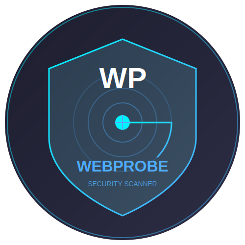

# WebProbe

<div align="center">
  
  
  
  
  
  
</div>

## 🔍 Overview

WebProbe is a powerful web application security scanner built with Python and Flask. It helps identify common web vulnerabilities such as Cross-Site Scripting (XSS) and SQL Injection (SQLi) in web applications.

## ✨ Features

- 🔒 **Security Scanning Capabilities:**
  - Cross-Site Scripting (XSS) Detection
  - SQL Injection Testing
  - Security Headers Analysis
  
- 📊 **Reporting:**
  - Detailed PDF Report Generation
  - Vulnerability Classification
  - Security Score Calculation
  
- 👤 **User Management:**
  - User Registration and Authentication
  - Scan History Tracking
  - Individual User Dashboards

## 🚀 Quick Start

### Prerequisites

- Python 3.8 or higher
- pip (Python package manager)

### Installation

1. Clone the repository:
```bash
git clone https://github.com/AnGrY-Althaf/WebProbe.git
cd WebProbe
```

2. Install required dependencies:
```bash
pip install -r requirements.txt
```

3. Run the application:
```bash
python3 webprobe.py
```

4. Access the scanner interface:
```
http://127.0.0.1:5000
```

## 📖 Usage

1. Register for a new account or login
2. Navigate to the scanning dashboard
3. Enter the target URL you want to scan
4. Review the scan results and download the detailed PDF report

## 🛡️ Security Features

- **XSS Detection:** Identifies potential cross-site scripting vulnerabilities
- **SQL Injection:** Tests for various SQL injection attack vectors
- **Header Analysis:** Checks for security-related HTTP headers
- **Secure Authentication:** Implements secure user authentication and session management

## 🔧 Configuration

The scanner can be configured by modifying the following files:
- `payloads.json`: Custom payload configurations
- `config.py`: Application configuration settings

## 📝 Contributing

Contributions are welcome! Please feel free to submit a Pull Request.

1. Fork the repository
2. Create your feature branch (`git checkout -b feature/AmazingFeature`)
3. Commit your changes (`git commit -m 'Add some AmazingFeature'`)
4. Push to the branch (`git push origin feature/AmazingFeature`)
5. Open a Pull Request

## ⚠️ Disclaimer

This tool is for educational and security testing purposes only. Always ensure you have permission to scan the target web application. The authors are not responsible for any misuse or damage caused by this program.

## 📄 License

This project is licensed under the MIT License - see the [LICENSE](LICENSE) file for details.

## 📞 Contact

- Project Link: [https://github.com/AnGrY-Althaf/WebProbe](https://github.com/AnGrY-Althaf/WebProbe)
- Linkedin    : https://www.linkedin.com/in/althaf-shajahan-978b67240/

## 🙏 Acknowledgments

- Flask Framework
- Python Security Community
- All Contributors

---

<div align="center">
Made with ❤️ by AnGrY-Althaf
</div>
